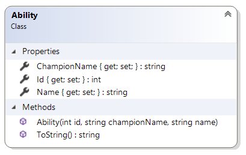

# C# Advanced - LeagueSimulator

**Algemene richtlijnen**
* Het examen moet afgelegd worden op drie uur.
* Je mag gebruik maken van oefeningen en je oplossingen, de slides, de syllabus en het handboek.
* Er mag op geen enkele manier gebruik gemaakt worden van het **internet**, een **gsm of externe hulp**.

## League Simulator opdracht
De nieuwe opleiding van de PXL, E-Sports, heeft aan jou gevraagd om een simulatie tool te maken voor het befaamde spel, League of Legends. De studenten van E-Sports willen een beter inzicht krijgen in de verschillende samenstellingen van teams en wat de beste strategieën zijn.

De E-Sports studenten willen achteraf hun simulaties kunnen bestuderen. Hierdoor zal je applicatie een export functie moeten voorzien die de waardevolle data omzet naar een XML file.

De applicatie bestaat uit twee delen: een class library, genaamd LeagueClassLibrary, en een WPF project, genaamd MainWindow, met één venster.

---
> [!TIP] 
> Tijdens deze opdracht zal je LINQ gebruiken op een DataTable en DataView. Gebruik de volgende methodes om `.AsEnumerable()` en `.AsDataView()`

```
// Tip: Gebruik .AsEnumerable() om LINQ toe te passen op een DataTable
var highDamageAbilities = abilitiesTable
    .AsEnumerable()
    .Where(row => row.Field<int>("Damage") > 100)
    .Select(row => row.Field<string>("Name"))
    .ToList();
```

```
// Tip: Gebruik .AsDataView() om het resultaat van een LINQ-query te tonen in een DataGrid
DataView filteredView = (from row in championsTable.AsEnumerable()
                         where row.Field<string>("Role") == "Support"
                         select row).AsDataView();

championsDataGrid.ItemsSource = filteredView;
```

---

**Overzicht:**
        
1. Class Library
    - 1.1. Statische klassen
    - 1.2. Entities
    - 1.3. Interface
    - 1.4. Klassen Diagram
2. Wpf Vensters
    - 2.1 Simulator (MainWindow)

## 1. Class Library

In de League Simulator toepassing maken we gebruik van een class library. De class library, genaamd LeagueClassLibrary, gebruiken we om de data van de abilities, champions en matches te beheren en te exporteren.

In de class library zitten twee folders: één folder genaamd DataAccess en één folder genaamd Entities.

De DataAccess folder bevat statische klasses AbilityData, ChampionData en MatchData. Deze klasses verwerken de csv bestanden en exporteren de matches. Deze klassen zitten in de LeagueClassLibrary.DataAccess namespace.

De tweede folder, genaamd Entities, bevat de entity klasses voor Match, SummonersRift, TwistedTreeline, Champion, Ability en een interface IWinnable. Deze klassen zitten in de LeagueClassLibrary.Entities namespace.


## 1.1 Statische klassen

### 1.1.1 ChampionData:

 - Private variable: _dataTableChampions – DataTable
    - De DataTableChampions kolommen voor position2 en position3 kunnen null zijn. Zie de csv en Tabel 1.
 - Private variable: r - Random
    - Het random object wordt gebruikt in GetRandomChampionByPosition(string position). 
 - Publieke methode: LoadCSV(string padNaarCsv) – void
    - LoadCSV(string padNaarCsv) zorgt ervoor dat de DataTableChampions geïnitialiseerd is. De methode gebruikt het pad naar het csv bestand dat meegegeven wordt om de DataTable te vullen met records.
 - Publieke methode: GetDataViewChampion() –  DataView
    - Deze methode zet de data uit DataTableChampions om naar een  DataView.
 - Publieke methode: GetDataViewChampionsByPosition(string position) - DataView
    - Deze methode filtert DataTableChampions op basis van position. Als een champion de gegeven position bevat, dan wordt de champion weergegeven in de DataView.
 - Publieke methode: GetDataViewChampionsBestToWorst() - DataView
    - Deze methode sorteert de rijen in DataTableChampions op de volgende criteria:
        - Op het jaar dat ze zijn uitgekomen. Meest recent naar oud.
        - Vervolgens op hoeveel posities een champion heeft. Meer posities naar minder.
        - Tot slot op de alfabetische volgorde van de naam.
 - Publieke methode: GetRandomChampionByPosition(string position) - Champion
    - Deze methode geeft een willekeurig Champion object terug uit DataTableChampions die de gegeven position bevat. Maak gebruik van de GetAbilitiesByChampionName(string name) methode uit AbilityData om de abilities op te vragen.


Het bestand leagueOfLegendsChampions.csv ziet er als volgt uit:

| Name     | Title                    | Class      | Release Year | Position1 | Position2 | Position3 | Icon                    | Banner                   | RP Cost | IP Cost |
|----------|--------------------------|------------|---------------|-----------|-----------|-----------|-------------------------|--------------------------|---------|---------|
| Sona     | The Maven of the Strings | Enchanter  | 2010          | sup       | mid       | null      | icons/sona_icon.png     | banners/sona_banner.jpg  | 790     | 3150    |
| Shyvana  | The Half-Dragon          | Juggernaut | 2011          | jung      | top       | null      | icons/shyvana_icon.png  | banners/shyvana_banner.jpg | 790     | 3150    |

*Tabel 1: Champions*


### 1.1.2 AbilityData
 - Private variable: _abilities - List<Ability>
 - Publieke methode: LoadCSV(string padNaarCsv) – void
    - LoadCSV(string padNaarCsv) zorgt er voor dat de Abilities list geïnitialiseerd is. De methode gebruikt het pad naar het csv bestand dat meegegeven wordt om de List te vullen met Ability objecten.
 - Publieke methode: GetAbilitiesByChampionName(string championName) – List<Ability>
    - Deze methode geeft een list terug van Ability objecten die van een champion zijn met de gegeven naam. Gebruik hier een Linq query voor.

Het bestand leagueOfLegendsAbilities.csv ziet er als volgt uit:

| AbilityId | ChampionName | AbilityName           |
|-----------|--------------|------------------------|
| 1         | Aatrox       | Deathbringer Stance    |
| 2         | Aatrox       | The Darkin Blade       |

*Tabel 2: Abilities*

### 1.1.3 MatchData
 - Private variable: _dataTableMatches - DataTable
 - Publieke methode: InitializeDataTableMatches() - void
    - Deze methode initialiseert de DataTableMatches met een Id (int), Code (string) en Winner (string) kolom. Zorg er voor dat de Id kolom automatisch incrementeert. Zie tabel 3.
 - Publieke methode: AddFinishedMatch(Match match) - void
    - Deze methode voegt een match toe aan de DataTableMatches.  Verander de team code van het match object naar de namen: “Red” of “Blue”. Als de Winner eigenschap van het match object gelijk is aan 1, dan wint team “Red”. Zoniet, dan wint team “Blue”.
 - Publieke methode: GetDataViewMatches() - DataView
    - Deze methode  zet de data uit DataTableMatches om naar een  DataView.
 - Publieke methode: ExportToXML() - void
    - Deze methode exporteert de inhoud van DataTableMatches naar een bestand, genaamd “Matches.xml”. Laat de gebruiker zelf kiezen waar hij of zij dit bestand wenst op te slaan.
 - Publieke methode: IsUniqueCode(string code) - bool
    - Deze methode geeft true terug als de gegeven code nog niet voorkomt in DataTableMatches.


| Id | Winner | Code    |
|----|--------|---------|
| 1  | Blue   | Xalwi2l |
| 2  | Red    | PXL     |

*Tabel 3: Matches*

## 1.2 Entities

Maak de volgende klassen: Ability, Champion, Match, SummonersRift, TwistedTreeline. Maak de volgende interface: IWinnable. De interface zorgt er voor dat elke match winbaar is met de methode DecideWinner() en een eigenschap Winner.

### Match (*):
- Eigenschap: Team1Champions - List<Champion>
- Eigenschap: Team2Champions - List<Champion>
- Eigenschap: Winner - int
- Eigenschap: Code - string
- Constructor met één parameter: code.
- Publieke abstracte methode: GenerateTeams() - void  

### SummonersRift:
 - Erft over van Match
 - Overschrijft GenerateTeams: 
    - Deze methode zorgt er voor dat de twee lists, Team1Champions en Team2Champions elk gevuld zijn met vijf champion objecten met de positions “sup”, “mid”, “jung”, “bot” en “top”. Gebruik hier de GetRandomChampionByPosition(position) methode van ChampionData voor.

### TwistedTreeline:
 - Erft over van Match
 - Overschrijft GenerateTeams:
    - Deze methode zorgt er voor dat de twee lists, Team1Champions en Team2Champions elk gevuld zijn met drie champion objecten met de positions “top”, “top” en “jung”. Gebruik hier de GetRandomChampionByPosition(position) methode van ChampionData voor.

### Champion:
 - Eigenschap: Name - string
 - Eigenschap: Title - string
 - Eigenschap: Class - string
 - Eigenschap: ReleaseYear - int
 - Eigenschap: Abilities - List<Ability>
 - Eigenschap: Positions - List<string>
 - Eigenschap: IconSource - string
 - Eigenschap: BannerSource - string
 - Eigenschap: CostIP - int
 - Eigenschap: CostRP - int
 - Constructor met een parameter voor elke eigenschap.
 - Overschrijft ToString():
     - Deze methode geeft de naam en titel terug van de champion.
 - Publieke methode: GetCost() - string
     - Deze methode geeft de IP en RP cost terug in de volgende template: “RP: {CostRP} / IP: {CostIP}”.

### Ability:
 - Eigenschap: Id - int
 - Eigenschap: ChampionName - string
 - Eigenschap: Name - string
 - Constructor met een parameter voor elke eigenschap.
 - Overschrijft ToString():
     - Deze methode geeft de naam terug van de ability.

(*) De klasse Match is abstract en implementeert de interface IWinnable.

## 1.3 Interface

### IWinnable:
 - Eigenschap: Winner – int
 - Methode: DecideWinner() – void
     - De winnaar wordt bepaald op basis van de volgende criteria:
         - Het team met de champions die het meest recente gemiddelde ReleaseYear hebben wint.
         - Indien twee teams hetzelfde gemiddelde ReleaseYear hebben, dan wint het team met de meeste champions die de Assassin Class hebben.
         - Indien beide teams evenveel Assassin Classes hebben, dan wint team 1 (“Red”).

## 1.4 Klassen Diagram

De klassen diagram van de class library ziet er als volgt uit:



*Figuur 1: Entity - Ability*


*Figuur 2: Entity - Champion*


*Figuur 3: Match, TwistedTreeline, SummonersRift, IWinnable*


*Figuur 4: statische klassen*

---

## 2. WPF Vensters

De applicatie bevat een WPF project, genaamd GameClubWPF, dat bestaat uit twee vensters: een loginvenster (MainWindow), een overzichtsvenster (OverviewWindow).

### 2.1 MainWindow
**Programmeer voorwaarden:**
- Wanneer het venster geladen wordt, dan worden er vijf posities ingevuld in de ComboBoxPositions, namelijk: "sup", "mid", "bot", "jung", "top".


*Figuur 5: ingeladen positie opties*

 - Als gebruiker kan ik op de “Laad Champion Data”-knop klikken om een csv file te selecteren via een dialoogvenster. Gebruik hier de LoadCSV(ofd.FileName) van ChampionData voor.
    - Als de correcte file is geselecteerd, dan wordt de data geladen en wordt er de CheckBoxLaadChamionData aangevinkt.
    
    </br>
    *Figuur 6: correct bestand*
    - Als een incorrect bestand is geselecteerd, dan wordt de gebruiker hiervan gewaarschuwd in met een berichtvenster.
    
    </br>
    *Figuur 7: incorrect bestand*
    - Als de file correct werd geladen, dan wordt EnableTabsEnDataGridAlsDataGeladen() van MainWindow opgeroepen.
 - Als gebruiker kan ik op de “Laad Ability Data”-knop klikken om een csv file te selecteren via een dialoogvenster. Gebruik hier de LoadCSV(ofd.FileName) van AbilityData voor.
    - Als de correcte file is geselecteerd, dan wordt de data geladen en wordt er de CheckBoxLaadAbilityData aangevinkt.
    - Als een incorrect bestand is geselecteerd, dan wordt de gebruiker hiervan gewaarschuwd in met een berichtvenster.
    - Als de file correct werd geladen, dan wordt EnableTabsEnDataGridAlsDataGeladen() van MainWindow opgeroepen.
 - Private methode: EnableTabsEnDataGridAlsDataGeladen - void
    - Contorleer of zowel de ChampionData als de AbilityData geladen is, zoja dan wordt MatchData geladen en worden de “Simuleer Match”-tab en “Overzicht Matches”-tab enabled. Vervolgens worden ItemsSource’s van de DataGrid’s van het venster ingesteld.
    
    </br>
    *Figuur 8: Tabs enabled nadat data geladen is*
 - Als gebruiker kan ik een positie selecteren om enkel champions van deze positie te zien in de ComboBoxPositions. Zodra de gebruiker een keuze maakt, wordt de filter uitgevoerd.
    
    </br>
    *Figuur 9: positie selecteren*
 - Als gebruiker kan ik op de “Best to Worst”-knop klikken om het DataGrid te sorteren volgens de methode GetDataViewChampionsBestToWorst() van ChampionData.
    
    </br>
    *Figuur 10: Sort Best to Worst*
 - Als gebruiker kan ik op de “Reset”-knop klikken om alle champions in het DataGrid te zien.
 - Als gebruiker kan ik op een rij klikken in DataGridChampions om de afbeelding en naam en titel in te laden in MainWindow: ImageChampion en TextBlockChampionTitle.
    
    </br>
    *Figuur 11: Selectie in DataGridChampions*
 - Voorzie een private variabele voor een Match bject.
   - Private variable: currentMatch - Match
   - Gebruik later polymorfisme om zowel een TwistedTreeline object als een SummonersRift object in currentMatch op te slaan.
 - Als gebruiker kan ik op de “Genereer 5v5”-knop klikken om een SummonersRift object aan te maken in currentMatch dat twee teams van 5 Champion objecten genereert. Gebruik hier de GenerateTeams() methode.
   - Indien er geen code werd ingegeven in PasswordBoxMatchCode, dan toon je een foutmelding in een berichtvenster aan de gebruiker. Zie figuur 12.
    
   </br>
    *Figuur 12: Foutmelding voor geen code*
   - Indien de code in PasswordBoxMatchCode niet uniek is, dan toon je een foutmelding in een berichtvenster aan de gebruiker. Zie figuur 13.
   
   </br>
    *Figuur 13: Foutmelding code niet uniek*
 - Als gebruiker kan ik op de “Genereer 3v3”-knop klikken om een TwistedTreeline object aan te maken in currentMatch dat twee teams van 3 Champion objecten genereert. Gebruik hier de GenerateTeams() methode voor.
     - Indien er geen code werd ingegeven in PasswordBoxMatchCode, dan toon je een foutmelding in een berichtvenster aan de gebruiker. Zie figuur 12.
     - Indien de code in PasswordBoxMatchCode niet uniek is, dan toon je een foutmelding in een berichtvenster aan de gebruiker. Zie figuur 13.
 - Voorzie een methode LaadChampion(int indexChampion, int team) die opgeroepen wordt elke keer de gebruiker met zijn of haar muis op een ImageIconChampionXTeamX komt in het “Simuleer Match” TabItem. Zie figuur 14.
     - De ImageBanner wordt ingeladen op basis van de champion waarop ge-hovered wordt.
     - De TextBlockChampion wordt ingeladen op basis van de champion waarop ge-hovered wordt.
     - De TextBlockClass wordt ingeladen op basis van de champion waarop ge-hovered wordt.
     - De TextBlockCost wordt ingeladen op basis van de champion waarop ge-hovered wordt. Gebruik hiervoor de GetCost() methode van Champion.
     - De ListBoxChampionAbilities wordt leeggemaakt.
     - De abilities van de champion worden ingeladen in ListBoxChampionAbilities.
    
    </br>
    *Figuur 14: Champion details on hover*
 - Als gebruiker kan ik op de “Beslis Winnaar”-knop klikken om een winnaar te bepalen. Gebruik hiervoor de DecideWinner() methode van Match. Voeg vervolgens het currentMatch object toe aan DataTableMatch via AddFinishedMatch(Match match) van MatchData. Deze methode zet de int waarde van Winner om in een string: 1 wordt “Red”, 2 wordt “Blue”.
     - Vervolgens wordt het “Simuleer Match” TabItem volledig gelcleared. Gebruik hier de ClearSimulatieTab() methode voor.
 - Zorg er voor dat MainWindow een private methode heeft ClearSimulatieTab() die alle Match en Champion gerelateerde data reset.
     - Alle ImageIconChampionXTeamX afbeeldingen krijgen de “images/icons/empty_icon.png” als source.
     - De tekst in TextBlockChampion wordt verwijderd.
     - De tekst in TextBlockClass wordt verwijderd.
     - De tekst in TextBlockCost wordt verwijderd.
     - De items in ListBoxChampionAbilities worden verwijderd.
 - Als gebruiker kan ik toegevoegde wedstrijden zien in het “Overzicht Matches” TabItem. Zie figuur 15.

 </br>
 *Figuur 15: Match geschiedenis*

 - Als gebruiker kan ik op de “Export to XML”-knop klikken om alle data in DataTableMatches te exporteren naar een XML bestand. Gebruik hier de ExportToXML() methode voor van MatchData.
     - Als de data succesvol is geëxporteerd, dan toon je een berichtvenster aan de gebruiker met het goede nieuws. Zie Figuur 16.
      
     </br>
     *Figuur 16:  succesvol geëxporteerd*